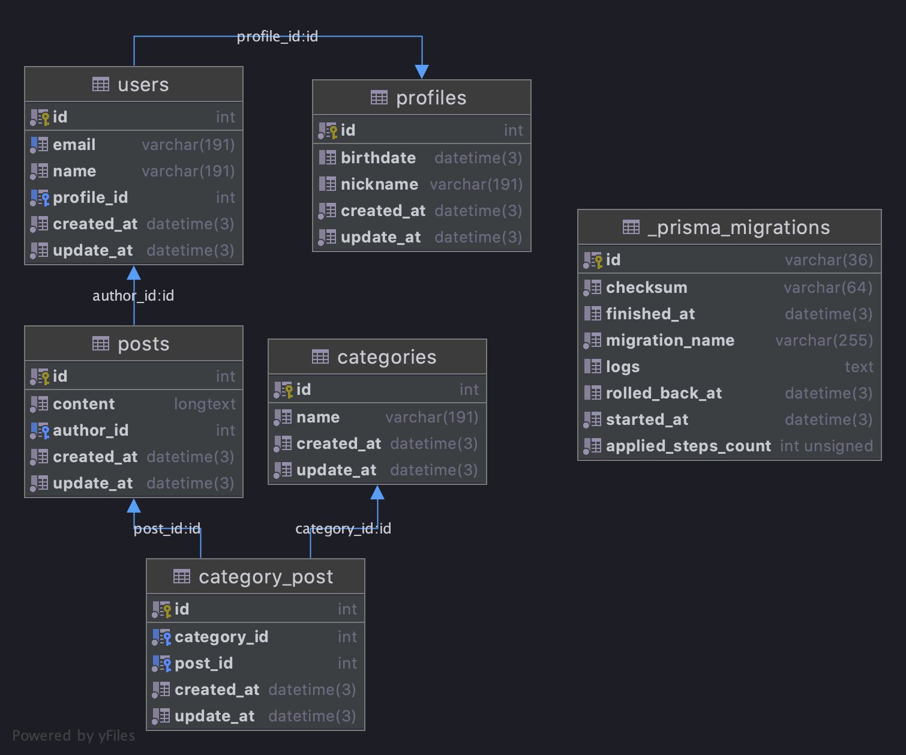

# Prisma schema

Typically called `schema.prisma` and consists of the following parts:

- [Data source](https://www.prisma.io/docs/concepts/components/prisma-schema/data-sources/): Specifies your database connection (via an environment variable)
- [Generator](https://www.prisma.io/docs/concepts/components/prisma-schema/generators/): Indicates that you want to generate Prisma Client
- [Data model](https://www.prisma.io/docs/concepts/components/prisma-schema/data-model/): Defines your application models

```prisma
// Data source
datasource db {
  provider = "postgresql"
  url      = env("DATABASE_URL") // DATABASE_URL="mysql://root:@mysql:3306/nestjs_prisma"
}

// Generator
generator client {
  provider = "prisma-client-js"
}

// Data model
model User {
  id        Int      @id @default(autoincrement())
  email     String   @unique
  name      String
  profileId Int      @map("profile_id")
  createdAt DateTime @default(now()) @map("created_at")
  updatedAt DateTime @default(now()) @map("update_at")

  posts   Post[]
  profile Profile @relation(fields: [profileId], references: [id])

  @@map("users")
}

model Profile {
  id        Int       @id @default(autoincrement())
  birthdate DateTime?
  nickname  String?
  createdAt DateTime  @default(now()) @map("created_at")
  updatedAt DateTime  @default(now()) @map("update_at")

  user User?

  @@map("profiles")
}

model Post {
  id        Int      @id @default(autoincrement())
  authorId  Int      @map("author_id")
  content   String   @db.LongText
  createdAt DateTime @default(now()) @map("created_at")
  updatedAt DateTime @default(now()) @map("update_at")

  author     User           @relation(fields: [authorId], references: [id])
  categories CategoryPost[]

  @@map("posts")
}

model Category {
  id        Int      @id @default(autoincrement())
  name      String
  createdAt DateTime @default(now()) @map("created_at")
  updatedAt DateTime @default(now()) @map("update_at")

  posts CategoryPost[]

  @@map("categories")
}

model CategoryPost {
  id         Int      @id @default(autoincrement())
  categoryId Int      @map("category_id")
  postId     Int      @map("post_id")
  createdAt  DateTime @default(now()) @map("created_at")
  updatedAt  DateTime @default(now()) @map("update_at")

  category Category @relation(fields: [categoryId], references: [id])
  post     Post     @relation(fields: [postId], references: [id])

  @@unique([postId, categoryId])
  @@map("category_post")
}
```



## Data model

- [Defining models](https://www.prisma.io/docs/concepts/components/prisma-schema/data-model#defining-models)
- [Define fields](https://www.prisma.io/docs/concepts/components/prisma-schema/data-model#defining-fields)
- [Defining attributes](https://www.prisma.io/docs/concepts/components/prisma-schema/data-model#defining-attributes)
- [Defining enums](https://www.prisma.io/docs/concepts/components/prisma-schema/data-model#defining-enums)

The properties of a model are called fields, which consist of:

- A [field name](https://www.prisma.io/docs/reference/api-reference/prisma-schema-reference/#model-fields). Such as: `id`, `name`, `email`.
- A [field type](https://www.prisma.io/docs/reference/api-reference/prisma-schema-reference/#model-fields). Such as: `Int`, `String`, `Post`, `Profile`. Type has two categories: [Scalar type](https://www.prisma.io/docs/concepts/components/prisma-schema/data-model/#scalar-fields) and Model types.
  - [Scalar type](https://www.prisma.io/docs/concepts/components/prisma-schema/data-model/#scalar-fields) (includes enums) that map to columns. Such as: `String`, `Int`. [Complete list of scalar field types](https://www.prisma.io/docs/reference/api-reference/prisma-schema-reference/#model-field-scalar-types).
  - Model types map to relations. Such as: `Post`, `Comment`.
- Optional [type modifiers](https://www.prisma.io/docs/concepts/components/prisma-schema/data-model#type-modifiers): The type of a field can be modified by appending either of two modifiers:
  - `[]` Make a field a list.
  - `?` Make a field optional.
- Optional [attributes](https://www.prisma.io/docs/concepts/components/prisma-schema/data-model#defining-attributes), including [native database type attributes](https://www.prisma.io/docs/concepts/components/prisma-schema/data-model#native-types-mapping). Such as: `@id`, `@default(autoincrement())`, ` @unique`, `@db.VarChar(200)`, `@db.TinyInt`.
  - [All available attributes](https://www.prisma.io/docs/reference/api-reference/prisma-schema-reference#attributes).
  - [All available Attribute functions](https://www.prisma.io/docs/reference/api-reference/prisma-schema-reference#attribute-functions).

Optional attributes, including native database type attributes

| Name      | Type      | Scalar vs Relation            | Type modifier | Attributes                            |
| :-------- | :-------- | :---------------------------- | :------------ | :------------------------------------ |
| `id`      | `Int`     | Scalar                        | -             | `@id` and `@default(autoincrement())` |
| `email`   | `String`  | Scalar                        | -             | `@unique`                             |
| `name`    | `String`  | Scalar                        | `?`           | -                                     |
| `role`    | `Role`    | Scalar (`enum`)               | -             | `@default(USER)`                      |
| `posts`   | `Post`    | Relation (Prisma-level field) | `[]`          | -                                     |
| `profile` | `Profile` | Relation (Prisma-level field) | `?`           | -                                     |
